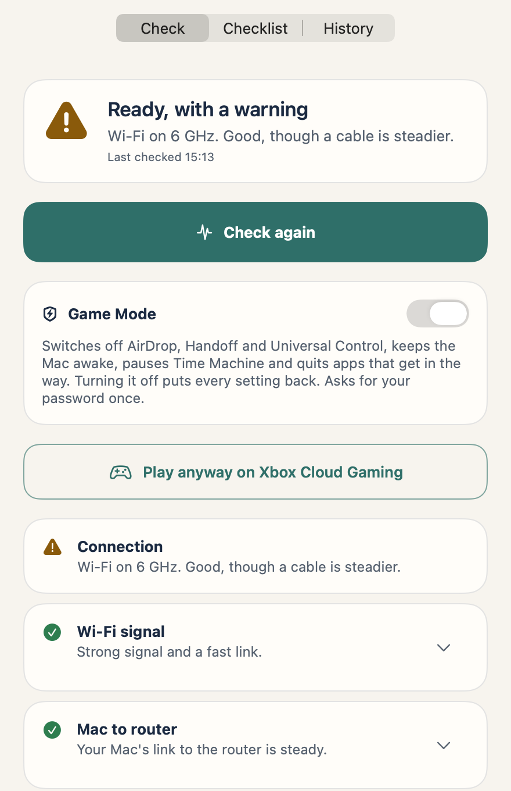
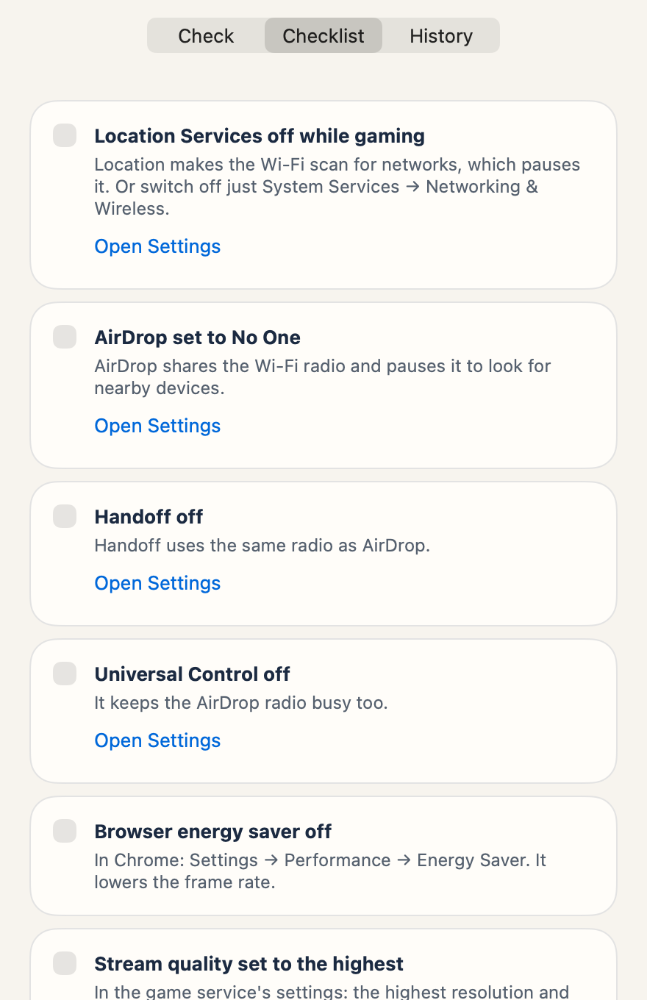
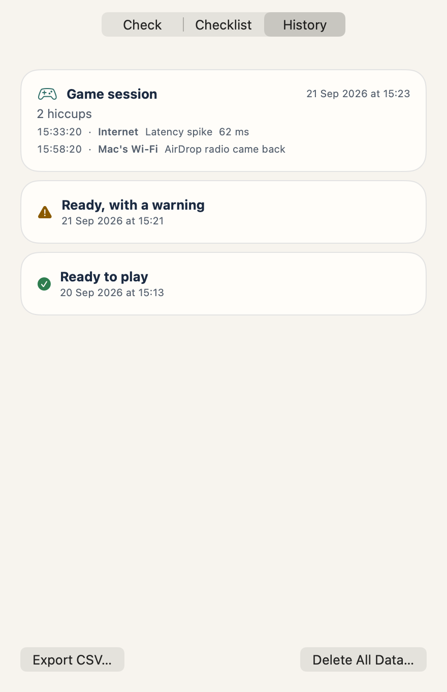
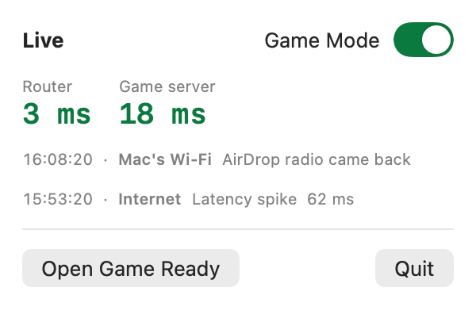
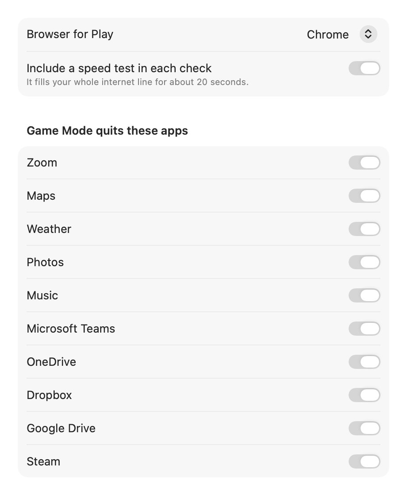
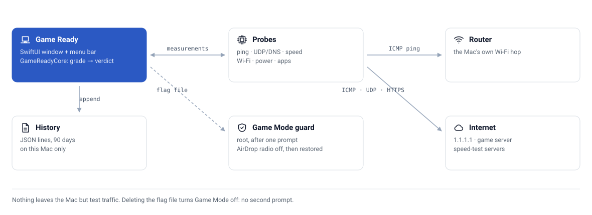

<div align="center">

# 🎮 Game Ready

**A Mac app that checks your Mac, Wi-Fi and internet before cloud gaming, switches the Mac into Game Mode, and tells you which one caused the lag while you play.**


[](https://github.com/CaputoDavide93/MacOS-Game-Mode/releases/latest)
[](https://github.com/CaputoDavide93/MacOS-Game-Mode/actions/workflows/ci.yml)

</div>

---

Cloud gaming (Xbox Cloud Gaming, GeForce NOW) lags for very different reasons: the Mac's own
Wi-Fi pausing for AirDrop, the household line filling up, or the game's servers. They all look
the same on screen. Game Ready measures each layer separately and gives one plain answer.

<p align="center"></p>

---

## 📸 Screenshots

<table>
  <tr>
    <td align="center" width="50%"><picture><source media="(prefers-color-scheme: dark)" srcset="docs/assets/screenshots/check-dark.png"></picture><br><sub>Check</sub></td>
    <td align="center" width="50%"><picture><source media="(prefers-color-scheme: dark)" srcset="docs/assets/screenshots/checklist-dark.png"></picture><br><sub>Checklist</sub></td>
  </tr>
  <tr>
    <td align="center"><picture><source media="(prefers-color-scheme: dark)" srcset="docs/assets/screenshots/history-dark.png"></picture><br><sub>History</sub></td>
    <td align="center"><picture><source media="(prefers-color-scheme: dark)" srcset="docs/assets/screenshots/menubar-dark.png"></picture><br><sub>Menu bar, during a game</sub><br><br><picture><source media="(prefers-color-scheme: dark)" srcset="docs/assets/screenshots/settings-dark.png"></picture><br><sub>Settings</sub></td>
  </tr>
</table>

All screenshots use demo data (`--screenshots`), never a real network.

---

## ✨ Features

| | Feature | What it does |
|---|---|---|
| 🩺 | Pre-flight check | 11 checks in about a minute: connection type, Wi-Fi signal, the Mac → router hop, internet and game-server latency, UDP loss over IPv4 and IPv6, speed with latency under load, whether the line is busy, the Mac's power and heat, background apps, and a checklist |
| 🚦 | One verdict | Ready, Ready with a warning, Not ready, or Couldn't finish. A check that couldn't measure never counts as a pass |
| ⚡ | Game Mode | Switches off the AirDrop/Handoff radio (and keeps it off), sets AirDrop to No One, turns off Handoff, Universal Control and Low Power Mode, pauses Time Machine, keeps the Mac awake, quits apps that get in the way. One password prompt; every setting is put back on "off" or quit, even after a crash |
| 🎮 | Play | Opens Xbox Cloud Gaming, GeForce NOW (its Mac app when installed) or Amazon Luna |
| 🎛️ | Better xCloud | Reads its settings to tick the checklist; opt-in, Game Mode sets the highest bitrate, the high H.264 profile and Prefer IPv6, and puts your own values back on "off" |
| 📈 | Live watch | While Game Mode is on, a menu-bar dot and a log label every hiccup: the Mac's Wi-Fi, the internet, or the Mac |
| ☑️ | Checklist | The settings no app can change for you (Location Services, AirDrop, Handoff, browser energy saver, stream quality), detected where macOS allows |
| 🗂️ | History | Checks and game sessions for 90 days on the Mac, CSV export, Delete All Data |
| 🔒 | Private | No accounts, analytics or update checks. Only test traffic leaves the Mac |
| 🌍 | Languages | English, Italian, Spanish, French, German, Portuguese (Brazil), Japanese, Chinese (Simplified), Korean and Hindi. Follows the Mac's language |

---

## 🗺️ Architecture

<picture>
  <source media="(prefers-color-scheme: dark)" srcset="docs/assets/architecture-dark.svg">
  
</picture>

- **`Packages/GameReadyCore`**: every rule, in pure Swift with no I/O: grading, the verdict,
  speed-test validation, the live-watch classifier, history, and the Game Mode guard script.
- **`App/`**: the probes (ping, UDP, speed, Wi-Fi, power, apps), Game Mode, the live watch
  and the SwiftUI screens.

Why each choice was made: [docs/decisions.md](docs/decisions.md). Look and feel: [docs/design.md](docs/design.md).

---

## 🚀 Quick Start

### Download

1. Get **Game-Ready.zip** from the [latest release](https://github.com/CaputoDavide93/MacOS-Game-Mode/releases/latest) and unzip it.
2. Move **Game Ready** to Applications and open it.
3. The first time, macOS blocks it because it isn't notarised yet: open **System Settings → Privacy & Security** and choose **Open Anyway**.

Apple silicon, macOS 15 or later.

### Build from source

Requires an Apple silicon Mac with macOS 15 or later, Xcode 16+, and [XcodeGen](https://github.com/yonaskolb/XcodeGen).

```bash
brew install xcodegen
scripts/build.sh                      # → build/…/Game Ready.app and dist/Game-Ready.zip
open "build/dd/Build/Products/Release/Game Ready.app"
```

The build is ad-hoc signed, not notarised, so the first launch needs **Open Anyway** as above.

To release: bump `MARKETING_VERSION` in `project.yml`, move the CHANGELOG's `[Unreleased]`
notes under the new version, then `git tag vX.Y.Z && git push --tags`. The Release workflow
tests, builds and publishes the zip with those notes.

---

## 📖 Usage

1. **Check now** (⌘R). Each step shows as it runs; the verdict card says what matters most.
2. Switch on **Game Mode** (⌘G). macOS asks for your password once.
3. **Play** (⌘P) opens your gaming service (Settings: Xbox Cloud Gaming, GeForce NOW or Amazon Luna) in Chrome, Safari or Edge.
4. Watch the dot in the menu bar. Turning Game Mode off puts every setting back and saves the session to History.

<details>
<summary>Letting Game Ready read and tune Better xCloud</summary>

1. Install [Better xCloud](https://github.com/redphx/better-xcloud) and open xbox.com once.
2. In the browser, allow scripts from other apps: **Chrome / Edge:** View → Developer → Allow
   JavaScript from Apple Events. **Safari:** Develop → Allow JavaScript from Apple Events.
3. Press **Refresh** on the Better xCloud card (Checklist). macOS asks once whether Game Ready
   may control the browser.
4. To have Game Mode tune it, turn on **Game Mode also tunes Better xCloud** in Settings.

The browser option lets any app you have allowed to control it run scripts in your web pages,
which is why it's off by default. Game Ready only ever runs the two fixed scripts in
`BetterXcloud.swift`.

</details>

From Terminal:

```bash
APP="build/dd/Build/Products/Release/Game Ready.app/Contents/MacOS/Game Ready"
"$APP" --check              # one check, results as JSON; exit 0 only when Ready
"$APP" --check --no-speed   # the same, without loading the line
"$APP" --screenshots out/   # every screen with demo data, light and dark
```

<details>
<summary>What each check measures</summary>

| Check | How | Good |
|---|---|---|
| Connection | Primary interface | Ethernet (6/5 GHz Wi-Fi warns, 2.4 GHz fails) |
| Wi-Fi signal | CoreWLAN signal and link rate | ≥ −60 dBm, ≥ 600 Mbps |
| Mac to router | 100 pings at 10/s | worst < 10 ms, no loss |
| Internet latency | 50 pings each to 1.1.1.1 and the game server | < 25 ms, jitter < 5 ms, no loss |
| Game traffic (UDP) | 200 DNS queries over IPv4 and IPv6 | no loss, p95 < 30 ms |
| IPv6 | Global address and UDP over IPv6 | works (never a failure) |
| Speed under load | 10 s download + 10 s upload, 4 streams, pinging all along | ≥ 40 Mbps down, latency rise < 15 ms |
| Line free | Idle latency vs. the best of the last 14 days | within 10 ms |
| This Mac | AirDrop radio, Low Power Mode, battery, heat, CPU | off, off, on power, nominal, < 80% |
| Background apps | Running apps from the Settings list, Time Machine | none |
| Checklist | Ticked or detected settings | all done |

Thresholds live in `Thresholds.swift`.

</details>

---

## 📁 Repo structure

```text
MacOS-Game-Mode/
├── App/
│   ├── Sources/            # 📱 probes, Game Mode, models, SwiftUI screens
│   ├── Resources/          # 🌍 Localizable.xcstrings (generated), icon sizes (generated)
│   └── Design/             # 🎨 AppIcon.svg, the icon's source
├── Packages/GameReadyCore/ # 🧠 rules + tests, no I/O
├── docs/                   # 📚 decisions, design, testing, screenshots, diagram
├── scripts/                # 🛠️ build.sh, check.sh
├── tools/                  # 🔧 strings/<lang>.json + gen_strings.py, gen_diagram.py, gen_icon.sh
└── project.yml             # ⚙️ XcodeGen project (the .xcodeproj is generated)
```

---

## 🧪 Testing

```bash
scripts/check.sh            # core tests, strings, diagram, shell lint, Release build
```

What's covered automatically and what has been verified on a real Mac: [docs/testing.md](docs/testing.md).

---

## 🔒 Security

Game Mode runs one script as root, after the macOS password prompt. The script is compiled
into the app, accepts only the app's own flag file, records what it changes and puts it back.
Details and how to report a problem: [SECURITY.md](SECURITY.md). Every privacy promise and its limits: [docs/privacy.md](docs/privacy.md).

---

## 📄 License

[MIT](LICENSE)

---

<p align="center"><sub>Made with ❤️ by <a href="https://github.com/CaputoDavide93">Davide Caputo</a></sub></p>
